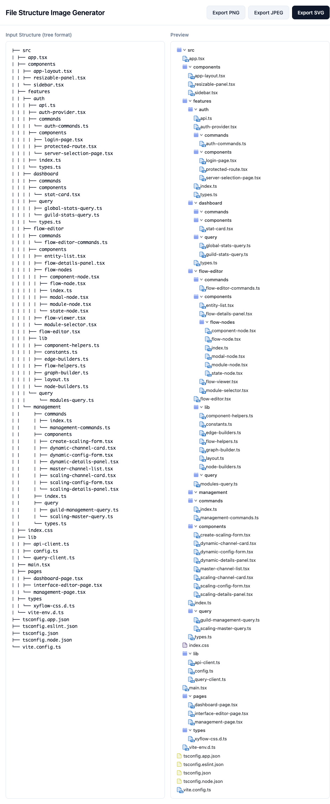

# create-file-structure-image

this image created out of this




```
├── src
│ ├── app.tsx
│ ├── components
│ │ ├── app-layout.tsx
│ │ ├── resizable-panel.tsx
│ │ └── sidebar.tsx
│ ├── features
│ │ ├── auth
│ │ │ ├── api.ts
│ │ │ ├── auth-provider.tsx
│ │ │ ├── commands
│ │ │ │ └── auth-commands.ts
│ │ │ ├── components
│ │ │ │ ├── login-page.tsx
│ │ │ │ ├── protected-route.tsx
│ │ │ │ └── server-selection-page.tsx
│ │ │ ├── index.ts
│ │ │ └── types.ts
│ │ ├── dashboard
│ │ │ ├── commands
│ │ │ ├── components
│ │ │ │ └── stat-card.tsx
│ │ │ ├── query
│ │ │ │ ├── global-stats-query.ts
│ │ │ │ └── guild-stats-query.ts
│ │ │ └── types.ts
│ │ ├── flow-editor
│ │ │ ├── commands
│ │ │ │ └── flow-editor-commands.ts
│ │ │ ├── components
│ │ │ │ ├── entity-list.tsx
│ │ │ │ ├── flow-details-panel.tsx
│ │ │ │ ├── flow-nodes
│ │ │ │ │ ├── component-node.tsx
│ │ │ │ │ ├── flow-node.tsx
│ │ │ │ │ ├── index.ts
│ │ │ │ │ ├── modal-node.tsx
│ │ │ │ │ ├── module-node.tsx
│ │ │ │ │ └── state-node.tsx
│ │ │ │ ├── flow-viewer.tsx
│ │ │ │ └── module-selector.tsx
│ │ │ ├── flow-editor.tsx
│ │ │ ├── lib
│ │ │ │ ├── component-helpers.ts
│ │ │ │ ├── constants.ts
│ │ │ │ ├── edge-builders.ts
│ │ │ │ ├── flow-helpers.ts
│ │ │ │ ├── graph-builder.ts
│ │ │ │ ├── layout.ts
│ │ │ │ └── node-builders.ts
│ │ │ └── query
│ │ │     └── modules-query.ts
│ │ └── management
│ │     ├── commands
│ │     │ ├── index.ts
│ │     │ └── management-commands.ts
│ │     ├── components
│ │     │ ├── create-scaling-form.tsx
│ │     │ ├── dynamic-channel-card.tsx
│ │     │ ├── dynamic-config-form.tsx
│ │     │ ├── dynamic-details-panel.tsx
│ │     │ ├── master-channel-list.tsx
│ │     │ ├── scaling-channel-card.tsx
│ │     │ ├── scaling-config-form.tsx
│ │     │ └── scaling-details-panel.tsx
│ │     ├── index.ts
│ │     ├── query
│ │     │ ├── guild-management-query.ts
│ │     │ └── scaling-master-query.ts
│ │     └── types.ts
│ ├── index.css
│ ├── lib
│ │ ├── api-client.ts
│ │ ├── config.ts
│ │ └── query-client.ts
│ ├── main.tsx
│ ├── pages
│ │ ├── dashboard-page.tsx
│ │ ├── interface-editor-page.tsx
│ │ └── management-page.tsx
│ ├── types
│ │ └── xyflow-css.d.ts
│ └── vite-env.d.ts
├── tsconfig.app.json
├── tsconfig.eslint.json
├── tsconfig.json
├── tsconfig.node.json
└── vite.config.ts
```
